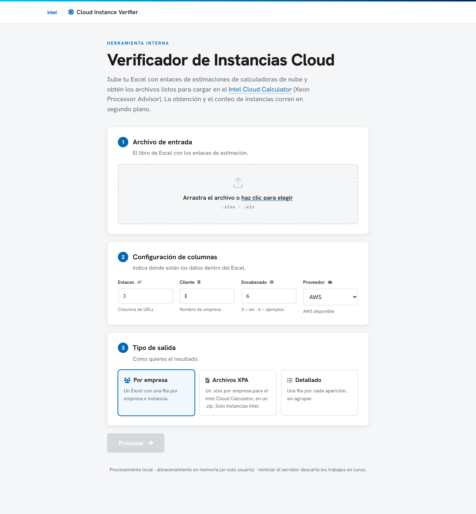

# Calc_Cloud — Verificador multinube de instancias


Aplicación web local que procesa un archivo Excel con enlaces a calculadoras de precios
de nube. Por cada enlace obtiene la estimación, extrae los tipos de instancia con sus
cantidades, clasifica el procesador (Intel / AMD / Graviton) y exporta un Excel
resumido.

Está pensada como multinube (tres proveedores), pero actualmente solo **AWS está
implementado y funcional**. La interfaz incluye un selector de proveedor; Azure y GCP
todavía no tienen lógica de obtención ni de parseo.

## Interfaz



## Requisitos

- Python 3.10 o superior. Durante la instalación, marca la opción "Add Python to PATH".

## Instalación

1. Copia la carpeta del proyecto a tu equipo.
2. Ejecuta `install.bat` una sola vez para instalar las dependencias.

## Uso

1. Ejecuta `run.bat`. El servidor inicia y se abre el navegador en
   http://localhost:5000.
2. Sube el archivo Excel (arrastrar y soltar, o seleccionar).
3. Indica los datos de las columnas:
   - Columna de enlaces: letra de la columna con las URLs de la calculadora.
   - Columna de cliente: letra de la columna con el nombre de empresa o cliente.
   - Fila de encabezado: número de fila donde están los títulos (normalmente 6).
4. Elige el tipo de salida: por empresa, detallado o archivos XPA (un `.xlsx` por
   empresa, comprimidos en un `.zip`; solo incluye instancias Intel).
5. Procesa y descarga el resultado al finalizar (un Excel, o un `.zip` si elegiste
   archivos XPA).

Para desarrollo, puedes iniciar el servidor con `python src/app.py`.

## Estructura del proyecto

```
Calc_Cloud/
├── src/
│   ├── app.py             # Rutas Flask y store de trabajos en memoria
│   ├── excel_processor.py # Lectura del Excel y armado del resumen
│   ├── aws_calculator.py  # Obtención y parseo de estimaciones de AWS
│   └── templates/
│       └── index.html     # Interfaz web de una sola página
├── tests/                 # Pruebas automatizadas
│   └── conftest.py        # Agrega src/ al path para las pruebas
├── docs/                  # Documentación
│   └── images/            # Capturas de la interfaz para el README
├── examples/              # Archivos de entrada para verificación manual
├── requirements.txt       # Dependencias de Python
├── install.bat            # Instalación de dependencias (primera vez)
├── run.bat                # Inicia el servidor y abre el navegador
├── README.md              # Este archivo
└── CLAUDE.md              # Notas de trabajo para asistentes de IA
```

## Cómo funciona

1. Se lee el Excel y se localizan las filas que contienen enlaces de calculadora.
2. Por cada enlace se obtiene la estimación y se recorre su contenido para acumular los
   tipos de instancia y sus cantidades.
3. Cada tipo de instancia se clasifica por procesador según la nomenclatura de AWS.
4. Los resultados se agrupan según el resumen elegido y se exportan a un Excel.

El procesamiento corre en segundo plano por cada trabajo; la interfaz consulta el avance
mediante sondeo periódico. El almacenamiento de trabajos es en memoria y para un solo
usuario: reiniciar el servidor pierde los trabajos en curso.

## Limitaciones conocidas

- Solo AWS está implementado; el selector de proveedor aún no habilita Azure ni GCP.
